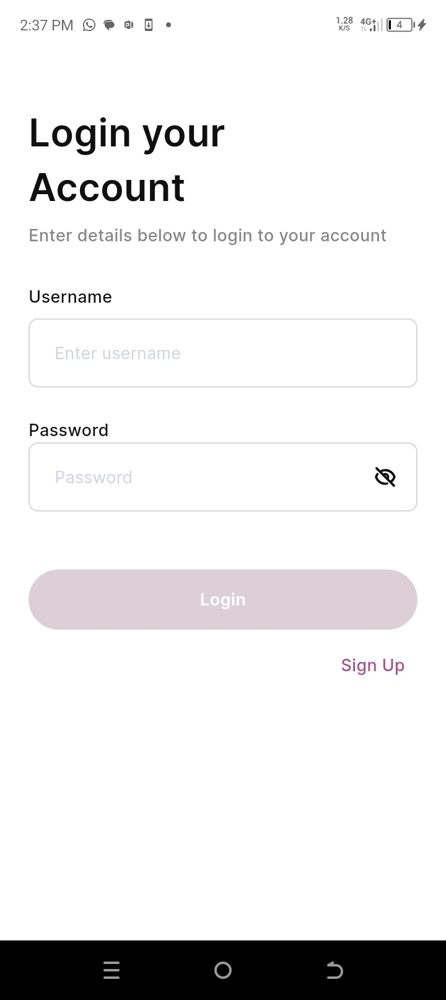
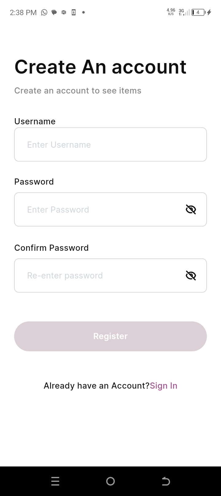
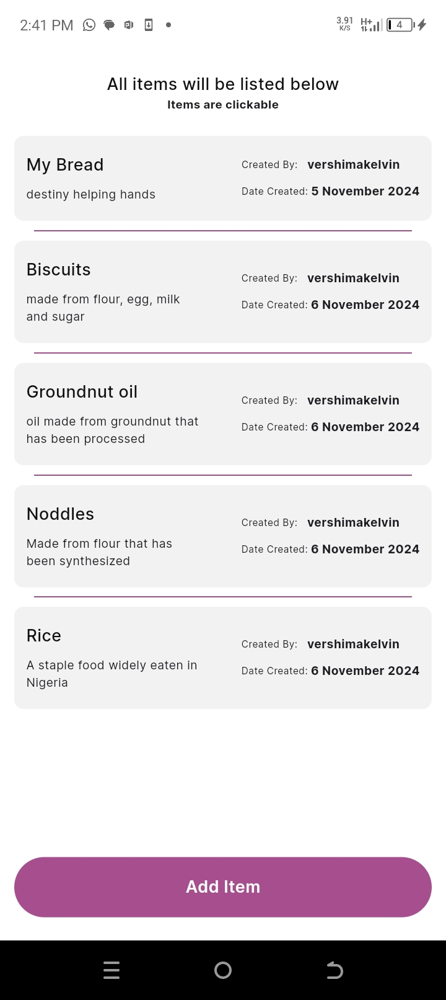
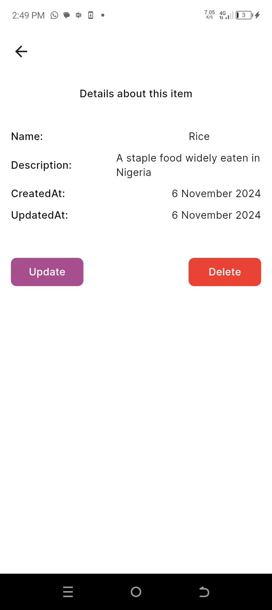
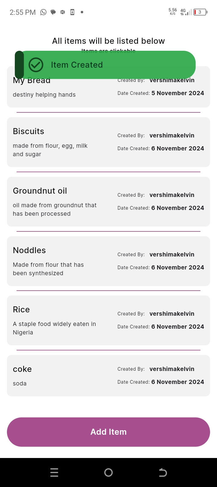

# MBL QA Task

This repository contains a simple app i built to interact with and test the API endpoints specified in the Postman documentation provided by MBL Limited. The application consumes endpoints for various tasks, ensuring accurate API responses and demonstrating functionality based on the assignment requirements. Built using Flutter (dart), this project provides a user-friendly interface to perform actions aligned with the QA process.

---

## Getting Started 🚀

- [Flutter SDK](https://flutter.dev/docs/get-started/install) installed
- An IDE such as [Android Studio](https://developer.android.com/studio) or [Visual Studio Code](https://code.visualstudio.com/)


## Installation

1. **Clone the Repository**:
   ```bash
   git clone https://github.com/username/repo-name.git
   cd repo-name
   
2. **Install Dependencies**:
   ```bash
   flutter pub get

3. **Generate necessary files**:
   ```bash
   flutter pub run build_runner build --delete-conflicting-outputs

4. **Run on Emulator or Connected Device**:
   ```bash
   flutter run
   
5. **Specify Device (if multiple devices are connected)**:
   ```bash
   flutter run -d <device_id>


## Testing the API Integration
The UI allows you to interact with the endpoints by sending requests and viewing responses directly. Follow on-screen instructions to test each API.


## Building an APK
You can build an apk for test on a real device by running 

1. **Open your project in Terminal or Command Prompt**:
   Navigate to your Flutter project directory.

   ```bash
   cd path/to/your/flutter/project

2. **Run the build command**:
   Use the following command to build a release APK:

   ```bash
   flutter build apk --release

3.  **Locate the APK**:
   After the build completes, find your APK in the following directory:

   ```bash
   build/app/outputs/flutter-apk/app-release.apk

## ScreenShots

Here are some screenshootes taken from an android device

|  Screen column1  |                         Screen column2                         |  Screen column3
:------------:|:--------------------------------------------------------------:|:-------------------------:
|  | 
|                | 

## Running Tests 🧪

To run all unit and widget tests use the following command:

```sh
$ flutter test --coverage --test-randomize-ordering-seed random
```
